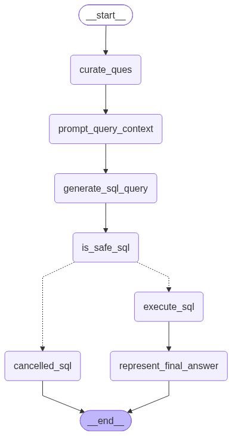
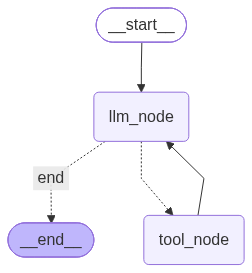

# Cab Service Data AI Agent

A multi-agent system built with **LangGraph** that lets you query and process a synthetic ride-hailing (cab service) dataset using natural language. A router agent classifies each request as either a **SQL query** (read-only analytics over a Postgres warehouse) or an **ETL task** (extract data from an API / transform a local file), then hands off to the appropriate specialist sub-agent.

## Architecture

```
                    ┌───────────────┐
                    │   Data Agent  │  (router)
                    └───────┬───────┘
                            │
              ┌─────────────┴─────────────┐
              ▼                           ▼
      ┌───────────────┐           ┌───────────────┐
      │  SQL Analyst  │           │  ETL Analyst  │
      │    Agent      │           │    Agent      │
      └───────────────┘           └───────────────┘
```

### 1. Data Agent (router) — `agents/data_agent.py`
Classifies the incoming user message as `sql` or `etl` (via a structured-output LLM call) and routes to the matching sub-agent.


### 2. SQL Analyst Agent — `agents/sql_analyst.py`
Converts a natural-language question into a Postgres query, checks it for safety, executes it, and summarizes the result back in plain English.

| Node | Purpose |
|---|---|
| `curate_ques` | Cleans up / rephrases the raw user question |
| `prompt_query_context` | Pulls live DB schema + sample rows and builds the SQL-generation prompt |
| `generate_sql_query` | LLM generates the Postgres query |
| `is_safe_sql` | A second LLM acts as a judge, rejecting any query containing `INSERT`/`UPDATE`/`DELETE`/`DROP`/`ALTER`/`TRUNCATE`/`CREATE` — read-only enforcement |
| `execute_sql` | Runs the approved query against Postgres |
| `cancelled_sql` | Short-circuits with an explanation if the query was rejected |
| `represent_final_answer` | Turns the raw result set into a natural-language answer |



### 3. ETL Analyst Agent — `agents/etl_analyst.py`
A tool-calling agent that loops between an LLM node and a tool node until the requested ETL step is done.

| Tool | Purpose |
|---|---|
| `extract_load_tool` | Pulls JSON from an API endpoint and writes it to disk as CSV / JSON / Parquet |
| `transform_load_tool` | Has the LLM write pandas code (based on a preview of the source file) to transform and save the data, then executes it |



## Dataset

A synthetic cab-service dataset lives in `data/` and is loaded into Postgres via `feed_db.py`:

| Table | Rows (approx.) | Notes |
|---|---|---|
| `users` | 10,000 | Riders and drivers, with city/province, signup date, active flag |
| `vehicles` | 3,000 | FK to driver in `users` |
| `rides` | 20,000 | Pickup/dropoff coordinates & timestamps, fare, surge multiplier, status, cancellation reason |
| `ratings` | 12,000 | FK to ride/rider/driver |
| `payments` | 16,000 | FK to ride/user, payment method & status |

`feed_db.py` creates the schema (with foreign keys between the tables above) and bulk-loads each CSV.

## Tech Stack

- **Python 3.13**, dependency management via **uv** (`pyproject.toml` / `uv.lock`)
- **LangGraph** — agent orchestration / state machines
- **LangChain** + **langchain-google-genai** — LLM calls (Gemini models)
- **PostgreSQL** via `psycopg2`
- **pandas** — ETL transforms
- **Pydantic** — typed agent state schemas (`Models/schema.py`)
- **python-dotenv** — environment/config loading

## Project Structure

```
CabService_Data_AI_Agent/
├── agents/
│   ├── data_agent.py       # Router agent (entry point of the graph)
│   ├── sql_analyst.py      # NL → SQL agent with safety gate
│   ├── etl_analyst.py      # Tool-calling ETL agent
│   └── scatchpad.py        # Ad-hoc scratch/testing script
├── Models/
│   └── schema.py           # Pydantic state schemas shared across agents
├── utils/
│   ├── database.py         # Postgres schema introspection + query execution
│   ├── etl_tools.py        # Extract/transform helper functions
│   └── llm_pick.py         # Picks a Gemini model by tier: low / medium / high
├── data/                   # Synthetic CSV source data
├── feed_db.py              # Creates Postgres schema and loads data/*.csv
├── main.py                 # Entry point (WIP)
├── pyproject.toml / uv.lock
└── *.png                   # Exported LangGraph diagrams
```

## Setup

1. **Install dependencies** (requires [uv](https://docs.astral.sh/uv/)):
   ```bash
   uv sync
   ```
   or with pip:
   ```bash
   pip install -e .
   ```

2. **Create a `.env` file** in the project root:
   ```env
   host=localhost
   port=5432
   database=cab_service
   user=postgres
   password=your_password

   GOOGLE_API_KEY=your_gemini_api_key
   ```

3. **Set up Postgres and load data**:
   ```bash
   python feed_db.py
   ```

4. **Run an agent directly** (each agent file has a runnable example under `__main__`), e.g.:
   ```bash
   python agents/sql_analyst.py
   ```

## Usage Example

```python
from agents.data_agent import data_agent
from langchain_core.messages import HumanMessage

response = data_agent.invoke({
    "messages": [HumanMessage(content="What are the different payment methods we have?")],
    "route_response": ""
})
```

The router will detect this as a SQL-type question, hand it to the SQL Analyst Agent, which will inspect the live schema, generate a query, validate it's read-only, execute it, and return a plain-English answer.

## Running the Agent

`main.py` is the unified entry point — it wires up the Data Agent router and lets you chat with it from the command line:

```bash
python main.py
```

Example session:
```
> What are the different payment methods we have?
[Data Agent routes to SQL Analyst → generates query → safety check → executes → answers]
```

